Setting up Ubiquiti Unifi on DigitalOcean
=========================================

### Overview

As a freelancer, I build a lot of web sites.  That's a lot of code changes to track.  Thankfully, a Git-enabled workflow with proper branching makes short work of project tracking.  I can easily see development features in branches as well as a snapshot of the sites' production code.  A nice addition to that workflow is that ability to use Git to push updates to any of the various sites I work on while committing changes.

#### Contents <a name="top"></a>
+ [Prerequisites](#pr)
+ [Creating a droplet on DigitalOcean](#do)
+ [Connecting to a droplet](#cd)
+ [Setting up an Ubuntu environment](#su)
  - [Add a regular account](#su)
  - [Set up a firewall](#ufw)
  - [Update the system](#ud)
+ [Install UniFi](#un)
  - [Install the `unifi` package from repository](#un)
  - [Create a unifi profile for `ufw` firewall](#ufw2)
  - [Run the UniFi Setup Wizard](#us)
+ [Security best practices](#se)
  - [Disabling root login by SSH](#se)
  - [Setting up passwordless SSH login](#ps)
+ [Additional Reading](#ar)


### Prerequisites <a name="pr"></a>

* A DigitalOcean account
* A UniFi cloud account (optional)

[back to top](#top)

___

### Creating a droplet on DigitalOcean <a name="do"></a>

 1. After logging in to the DigitalOcean [dashboard][1], click the **Create** button and choose **Droplets** from the expanding menu.

    <p align="center">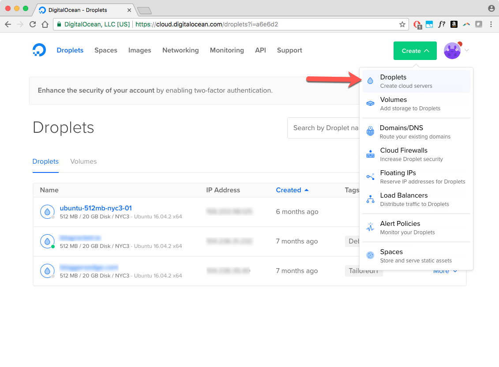</p>

 1. Under **Choose an image**, select **One-click apps** and then choose **MongoDB 3.4.10 on 16.04**.

    <p align="center">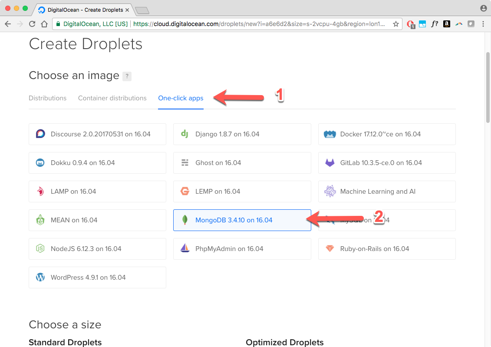</p>

 1. Under **Choose a size**, select a size that fits your budget. (The smallest size should be just fine to get started. It's easy to scale your application up as you grow.)

    <p align="center">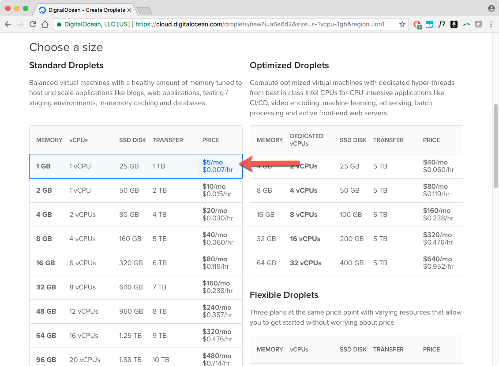</p>

 1. Under **Choose a datacenter region**, select a region that is close to you and your clients.
 1. Under **Select additional options**, select both `Backups` and `Monitoring`. These free addons are important for any production system.
 1. Under **Add your SSH keys**, select the SSH key for the machine you are currently working on or create one. If you choose not to use SSH authentication, you can still log in to your droplet using a username and password but SSH is the preferred method because of its increased security. More information about SSH logins can be found [here][4].

    <p align="center">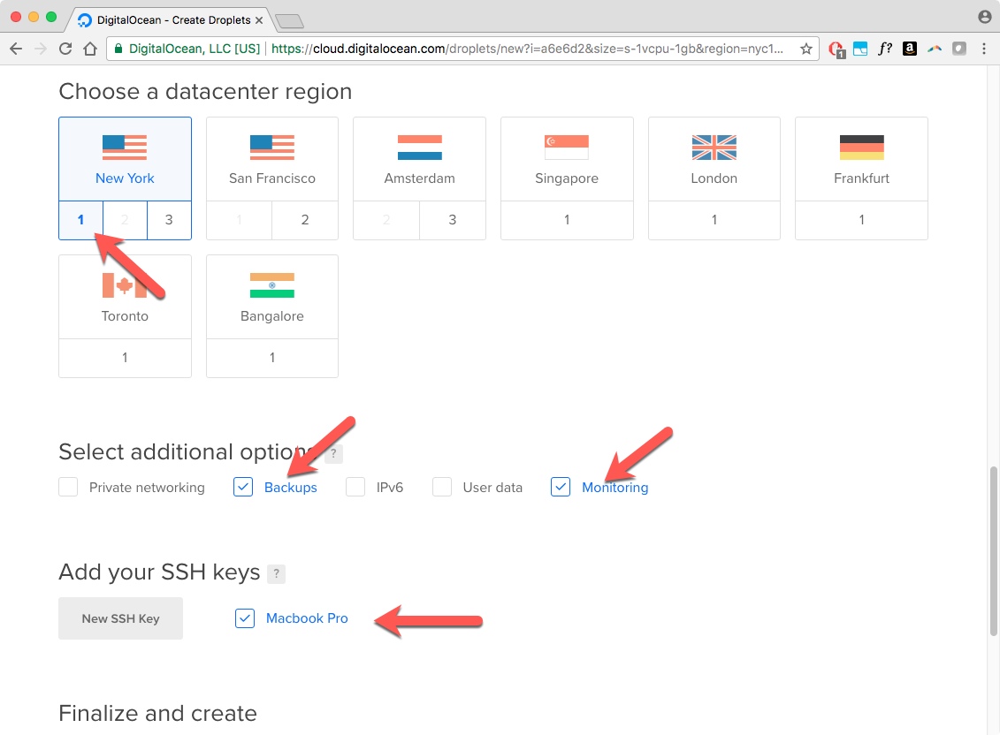</p>

 1. Under **Finalize and create**, assign your droplet and appropriate name and click the `Create` button.

    <p align="center">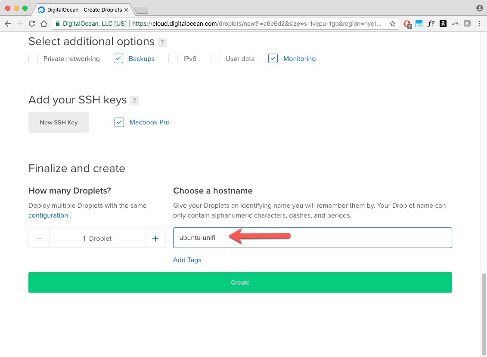</p>

Once your droplet is created, its details can be viewed in your droplets list. Make a note of the IP address that has been assigned to your droplet. You'll need this later along with the temporary password that you will receive in your welcome email.

<p align="center">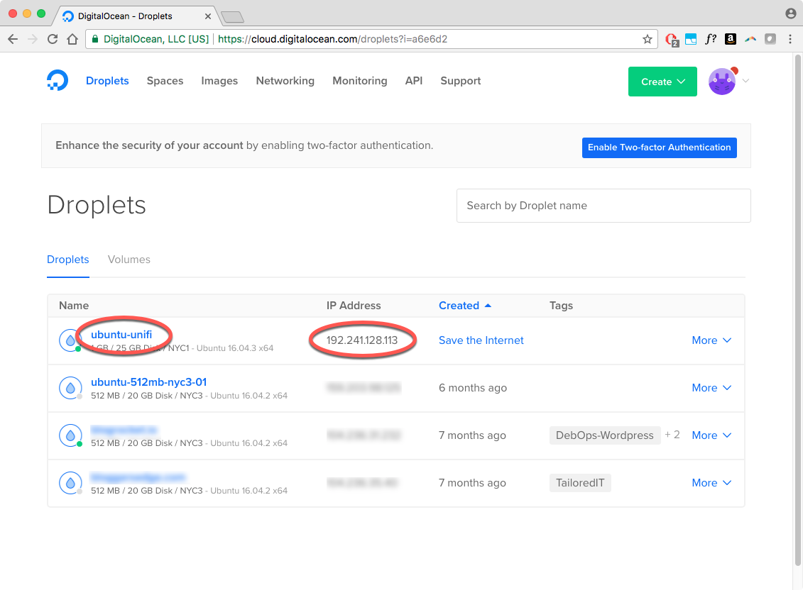</p>

[back to top](#top)

### Connecting to a droplet <a name="cd"></a>

You will use SSH to connect to your new DigitalOcean droplet. For Linux and Mac systems, this is easiest done using OpenSSH at the command line. Windows users are recommended to use the free [PuTTY][2] tool.

Fill in your details on the PuTTY Configuration dialog. Pay special attention the the IP address. Make sure that it matches the IP address of your new droplet.

<p align="center">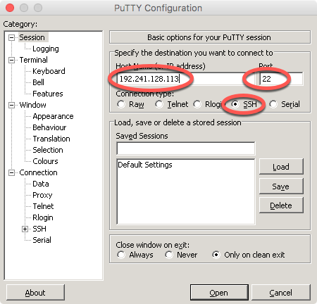</p>

Log in using the username *root* and the password that was supplied to you. When logging in for the first time, you will be required to set a permanent password for your root account. Once you have done this, you will be logged in to your droplet and you will have a root prompt.

<p align="center">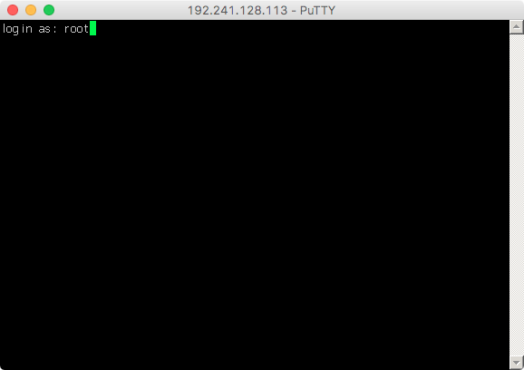</p>

PuTTY will also warn you that it does not recognize the certificate for the server your are connecting to. Since this is your first time connecting, select `Yes` to accept the server's certificate and open the connection.

<p align="center">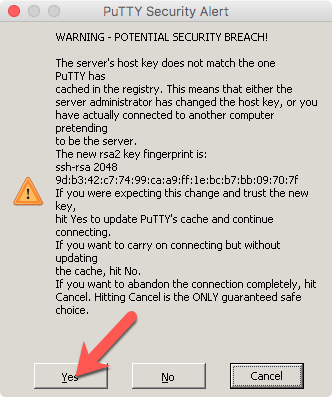</p>

To connect from the command line instead, use the following command:

	ssh root@<IP_ADDRESS>

<p align="center">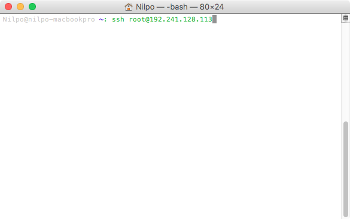</p>

[back to top](#top)

### Setting up an Ubuntu environment <a name="su"></a>

#### Add a regular account

 1. Add a regular user account.

    ```shell
    # adduser ubnt
    Adding user `ubnt' ...
    Adding new group `ubnt' (1000) ...
    Adding new user `ubnt' (1000) with group `ubnt' ...
    Creating home directory `/home/ubnt' ...
    Copying files from `/etc/skel' ...
    Enter new UNIX password: <YOUR_SECURE_PASSWORD>
    Retype new UNIX password: <YOUR_SECURE_PASSWORD>
    passwd: password updated successfully
    Changing the user information for ubnt
    Enter the new value, or press ENTER for the default
            Full Name []: Ubiquiti
            Room Number []: 
            Work Phone []: 
            Home Phone []: 
            Other []: 
    Is the information correct? [Y/n] Y
    ```

 1. Add the new user account to the sudoers group so that you can perform privileged commands.

    ```shell
    # usermod -aG sudo ubnt
    ```

 1. Log out and log back in using the newly created user.

    ```shell
    # exit
    $ ssh ubnt@<IP_ADDRESS>
    ```

[back to top](#top)

#### Set up a firewall <a name="ufw"></a>

 1. Make sure that the root directory is not writeable by group.

    ```shell
    $ sudo chmod g-w /
    ```

 1. We will use the built-in `ufw` firewall. You can see what apps are already recognized by `ufw` by using the following command.

    ```shell
    $ sudo ufw app list
    Available applications:
      OpenSSH
    ```

 1. Here you can see that it recognizes that OpenSSH is installed. Before enabling the firewall, we need to make sure that OpenSSH is allowed so that we can remain logged in.

    ```shell
    $ sudo ufw allow OpenSSH
    ```

 1. Now we can enable the firewall.

    ```shell
    $ sudo ufw enable
    ```

 1. Next we'll verify that the firewall is working.

    ```shell
    $ sudo ufw status
    Status: active
     
    To                         Action      From
    --                         ------      ----
    OpenSSH                    ALLOW       Anywhere
    OpenSSH (v6)               ALLOW       Anywhere (v6)
    ```

With the firewall enabled, the server is now reasonably secured.

[back to top](#top)

#### Update the system <a name="ud"></a>

Now is a good time to update all of the preinstalled packages on the server.

```shell
$ sudo apt-get update && sudo apt-get upgrade -y
```

[back to top](#top)

### Install UniFi <a name="un"></a>

#### Install the `unifi` package from repository

 1. Add the Unifi repository.

    ```shell
    $ echo 'deb http://www.ubnt.com/downloads/unifi/debian stable ubiquiti' | sudo tee /etc/apt/sources.list.d/100-ubnt-unifi.list
    ```

 1. Install the GPG key for the repository.

    ```shell
    $ sudo apt-key adv --keyserver keyserver.ubuntu.com --recv 06E85760C0A52C50
    ```

 1. Install the `unifi` package.

    ```shell
    $ sudo apt-get update && sudo apt-get install unifi -y
    ```

 1. Verify the `unifi` package is installed and running.

    ```shell
    $ sudo service unifi status
    ```

[back to top](#top)

#### Create a unifi profile for `ufw` firewall <a name="ufw2"></a>

 1. Create a configuration file for the profile.

    ```shell
    $ sudo nano /etc/ufw/applications.d/unifi
    ```

 1. Paste the following contents into the nano text editor.

    ```
    [Unifi]
    title=UniFi Controller
    description=The UniFi Controller software is used to provision, monitor, and administrate Ubiquiti devices.
    ports=8080,8443,8843,8880/tcp|3478/udp
    ```

 1. To save the file press `Ctrl`+`x`, then type `Y` and press `Enter`.

If everything was done correctly, `ufw` will now recognize the Unifi app.

    ```shell
    $ sudo ufw app list
    Available applications:
      OpenSSH
      Unifi
    ```

 1. Enable the unifi app.

    ```shell
    $ sudo ufw allow Unifi
    ```

    ```shell
    $ sudo ufw status
    Status: active
     
    To                         Action      From
    --                         ------      ----
    OpenSSH                    ALLOW       Anywhere
    Unifi                      ALLOW       Anywhere
    OpenSSH (v6)               ALLOW       Anywhere (v6)
    Unifi (v6)                 ALLOW       Anywhere (v6)
    ```

[back to top](#top)

#### Run the UniFi Setup Wizard <a name="us"></a>

The server is ready for all intents and purposes. Visit the following URL in your browser to continue setting up UniFi with supplied wizard.

    https://<IP-ADDRESS>:8443

<p align="center">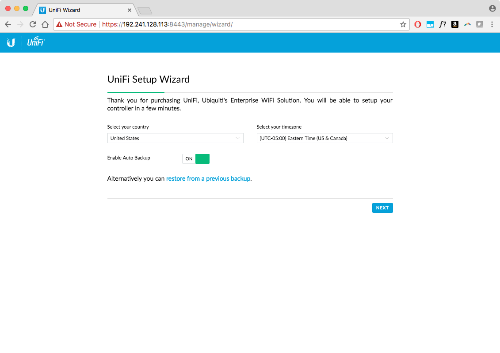</p>

[back to top](#top)


### Security best practices <a name="se"></a>

#### Disabling root login by SSH

After you [create a normal user](#su), you can disable SSH logins for the root account. This greatly improves security by eliminating the most commonly attacked account from remote logins.

 1. Log in to the server as *root* using SSH.

    ```shell
    ssh root@<IP_ADDRESS>
    ```

 1. Open the `/etc/ssh/sshd_config` file in your preferred text editor (nano, vi, etc.).

    ```shell
    nano /etc/ssh/sshd_config
    ```

 1. Locate the following line:

    ```
    PermitRootLogin yes
    ```

 1. Modify the line as follows:

    ```
    PermitRootLogin no
    ```

 1. Add the following line. Replace *username* with the name of the user you created earlier.

    ```
    AllowUsers username
    ```

    > This step is crucial. If you do not add the user to the list of allowed SSH users, you will be unable to log in to your server!

 1. Save the changes to the `/etc/ssh/sshd_config` file, and then exit the text editor.

 1. Restart the SSH service using the appropriate command for your Linux distribution:

    ```shell
    service ssh restart
    ```

 1. __While still logged in as root__, try to log in as the new user using SSH in a new terminal window. You should be able to log in. If the login fails, check your settings. __Do not exit your open root session__ until you are able to log in as the normal user in another window.

[back to top](#top)

#### Setting up passwordless SSH login <a name="ps"></a>

[back to top](#top)

___

#### Additional Reading <a name="ar"></a>

 + [How To Create Your First DigitalOcean Droplet][3]
 + [How To Connect To Your Droplet with SSH][4]
 + [How To Log Into Your Droplet with PuTTY (for windows users)][5]
 + [Initial Server Setup with Ubuntu 16.04][6]
 + [UFW Essentials: Common Firewall Rules and Commands][7]
 + [UniFi - How to Install & Update via APT on Debian or Ubuntu][8]
 + [UniFi - Ports Used][9]

[1]: https://cloud.digitalocean.com/droplets
[2]: http://www.putty.org/
[3]: https://www.digitalocean.com/community/tutorials/how-to-create-your-first-digitalocean-droplet
[4]: https://www.digitalocean.com/community/tutorials/how-to-connect-to-your-droplet-with-ssh
[5]: https://www.digitalocean.com/community/tutorials/how-to-log-into-your-droplet-with-putty-for-windows-users
[6]: https://www.digitalocean.com/community/tutorials/initial-server-setup-with-ubuntu-16-04
[7]:https://www.digitalocean.com/community/tutorials/ufw-essentials-common-firewall-rules-and-commands
[8]: https://help.ubnt.com/hc/en-us/articles/220066768-UniFi-How-to-Install-Update-via-APT-on-Debian-or-Ubuntu
[9]: https://help.ubnt.com/hc/en-us/articles/218506997-UniFi-Ports-Used

